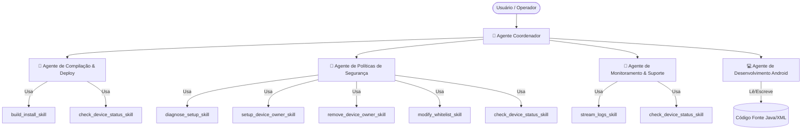

# Sistema Agêntico Baseado em Skills: ColetorBloqueado

Este diretório contém a especificação completa de um **Sistema Multiagente (MAS)** baseado em **Skills** modulares projetadas para interagir, gerenciar e dar suporte ao aplicativo Android **ColetorBloqueado**.

---

## 🏗️ Arquitetura do Sistema

A arquitetura separa o **Raciocínio (Agentes)** da **Execução (Skills/Ferramentas)**. O **Agente Coordenador** é o ponto de entrada que orquestra os demais agentes especializados.



---

## 🤖 Agentes Especializados

| Agente | Arquivo | Papel Principal |
|---|---|---|
| 🧠 **Coordenador** | [`coordinator_agent.md`](agents/coordinator_agent.md) | Orquestra todos os outros agentes. Ponto único de entrada para o usuário |
| 🔨 **Compilação & Deploy** | [`build_agent.md`](agents/build_agent.md) | Compila APKs via Gradle e instala no dispositivo via ADB |
| 🔐 **Políticas de Segurança** | [`policy_agent.md`](agents/policy_agent.md) | Gerencia Device Owner, whitelist e restrições DPM |
| 📡 **Monitoramento & Suporte** | [`monitoring_agent.md`](agents/monitoring_agent.md) | Captura e analisa logs em tempo real via ADB Logcat |
| 💻 **Desenvolvimento Android** | [`developer_agent.md`](agents/developer_agent.md) | Modifica código-fonte Java/XML com precisão cirúrgica |

---

## 🛠️ Catálogo de Skills (Toolbox)

| Skill | Arquivo | Versão | Agente(s) Primário(s) | Quando Usar |
|---|---|---|---|---|
| `build_install_skill` | [`build_install_skill.json`](skills/build_install_skill.json) | 2.0 | Build Agent | Compilar e/ou instalar o APK |
| `setup_device_owner_skill` | [`setup_device_owner_skill.json`](skills/setup_device_owner_skill.json) | 2.0 | Policy Agent | Configurar Device Owner via ADB |
| `remove_device_owner_skill` | [`remove_device_owner_skill.json`](skills/remove_device_owner_skill.json) | 2.0 | Policy Agent | Remover Device Owner (só Debug/testes) |
| `stream_logs_skill` | [`stream_logs_skill.json`](skills/stream_logs_skill.json) | 2.0 | Monitoring Agent | Capturar e filtrar logs em tempo real |
| `modify_whitelist_skill` | [`modify_whitelist_skill.json`](skills/modify_whitelist_skill.json) | 2.0 | Policy Agent | Gerenciar lista de apps permitidos |
| `check_device_status_skill` | [`check_device_status_skill.json`](skills/check_device_status_skill.json) | 1.0 | Todos | Verificar estado do dispositivo antes de agir |
| `diagnose_setup_skill` | [`diagnose_setup_skill.json`](skills/diagnose_setup_skill.json) | 1.0 | Policy Agent, Coordinator | Checklist pré-setup do Device Owner |

---

## 🔄 Fluxo de Trabalho Típico

### Configurar um Coletor Novo (do zero)

```
1. Coordinator → check_device_status_skill     → Snapshot do estado atual
2. Build Agent → build_install_skill            → Instalar APK se necessário  
3. Policy Agent → diagnose_setup_skill          → Checklist de pré-requisitos
4. [Usuário] → Remover contas Google            → Ação manual necessária
5. Policy Agent → setup_device_owner_skill      → Configurar Device Owner
6. Monitoring Agent → stream_logs_skill (10s)   → Verificar logs pós-setup
7. Coordinator → check_device_status_skill      → Confirmar estado final ✅
```

### Liberar um App no Coletor

```
1. Coordinator → check_device_status_skill      → Verificar se Device Owner está ativo
2. Policy Agent → modify_whitelist_skill(add)   → Adicionar pacote à whitelist
3. Policy Agent → check_device_status_skill     → Confirmar whitelist atualizada ✅
```

### Investigar Falha no Coletor

```
1. Monitoring Agent → check_device_status_skill → Estado atual
2. Monitoring Agent → stream_logs_skill          → Capturar logs
3. Monitoring Agent → Analisar padrões           → Classificar problema
4. → handoff para Developer Agent ou Policy Agent conforme necessidade
```

---

## 🚀 Como Utilizar

Cada agente possui um **System Prompt** em formato markdown e as skills possuem schemas no formato **OpenAI Function Calling / JSON Schema**.

### Integração com Frameworks LLM

```python
# Exemplo com LangChain
from langchain.tools import Tool
import json

with open("agentic_system/skills/build_install_skill.json") as f:
    skill = json.load(f)

build_tool = Tool(
    name=skill["name"],
    description=skill["description"],
    func=run_build_skill  # sua implementação do executor
)
```

### Uso via Prompting Direto

1. Copie o conteúdo da seção `## ⚙️ Diretrizes de Raciocínio (System Prompt)` do agente desejado.
2. Cole como **System Prompt** no seu LLM.
3. Carregue os JSONs das skills como **ferramentas disponíveis** (function calling).
4. O agente usará as skills e handoffs conforme necessário.

---

## 📁 Estrutura de Arquivos

```
agentic_system/
├── README.md                           ← Este arquivo
├── agents/
│   ├── coordinator_agent.md            ← 🧠 Orquestrador principal
│   ├── build_agent.md                  ← 🔨 Compilação e deploy
│   ├── developer_agent.md              ← 💻 Modificação de código
│   ├── monitoring_agent.md             ← 📡 Logs e diagnóstico
│   └── policy_agent.md                 ← 🔐 Device Owner e whitelist
└── skills/
    ├── README.md                       ← Guia de execução das skills
    ├── build_install_skill.json        ← Compilar e instalar APK
    ├── setup_device_owner_skill.json   ← Configurar Device Owner
    ├── remove_device_owner_skill.json  ← Remover Device Owner
    ├── stream_logs_skill.json          ← Capturar logs ADB
    ├── modify_whitelist_skill.json     ← Gerenciar whitelist
    ├── check_device_status_skill.json  ← Verificar estado do dispositivo ✨ NEW
    └── diagnose_setup_skill.json       ← Diagnóstico de pré-requisitos ✨ NEW
```
