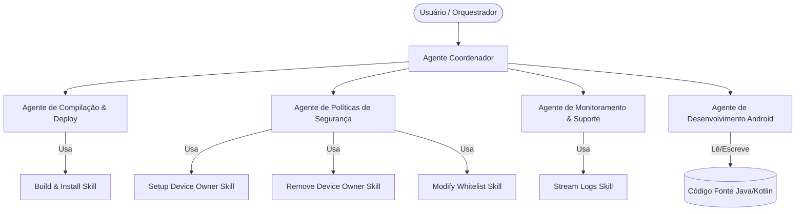

# Sistema Agêntico Baseado em Skills: ColetorBloqueado

Este diretório contém a especificação e as definições de um **Sistema Multiagente (MAS)** baseado em **Skills (Habilidades)** modulares projetadas especificamente para interagir, gerenciar e dar suporte ao aplicativo Android **ColetorBloqueado**.

---

## 🏗️ Arquitetura do Sistema

A arquitetura separa o **Raciocínio (Agentes)** da **Execução (Skills/Ferramentas)**. Cada agente possui diretrizes claras de atuação (System Prompts) e um subconjunto de Skills que pode invocar de forma autônoma para resolver problemas ou atender solicitações.

---

## 🤖 Agentes Especializados

1. **[Agente de Compilação & Deploy](agents/build_agent.md):** Focado em rodar pipelines de build local via Gradle, validar o empacotamento do APK e gerenciar o envio para o dispositivo de testes via ADB.
2. **[Agente de Políticas de Segurança](agents/policy_agent.md):** Especializado em configurar restrições corporativas de Device Owner (como bloqueio de barra de status e desinstalações) e gerenciar a lista de aplicativos permitidos (whitelist).
3. **[Agente de Monitoramento & Suporte](agents/monitoring_agent.md):** Responsável por capturar, filtrar e analisar os logs em tempo real do dispositivo, identificando crashs, exceções e burlas de segurança.
4. **[Agente de Desenvolvimento Android](agents/developer_agent.md):** Responsável pelo código do app (`MainActivity`, `MonitoramentoService`, layouts, permissões do manifesto e segurança de armazenamento).

---

## 🛠️ Catálogo de Skills (Toolbox)

As skills são as ferramentas reais acionadas pelos agentes. Elas abstraem e automatizam comandos complexos do sistema operacional e do SDK do Android.

*   **`build_install_skill`**: Executa a compilação do APK (`gradlew.bat assembleDebug`) e instala de forma não-interativa no aparelho alvo via `adb install`.
*   **`setup_device_owner_skill`**: Executa o comando de provisionamento de Device Owner via DPM (Device Policy Manager) no Android.
*   **`remove_device_owner_skill`**: Remove os privilégios administrativos ativos para testes e depuração.
*   **`stream_logs_skill`**: Filtra as tags cruciais de segurança no `logcat` e apresenta análises estruturadas.
*   **`modify_whitelist_skill`**: Altera as preferências e pacotes liberados no código ou nas configurações.

---

## 🚀 Como Utilizar

Cada agente e skill possui uma definição formal em formato de prompt e um schema em JSON no padrão **OpenAI Tool Spec / JSON Schema**. 

1. **Importação Automatizada:** As configurações na pasta `/skills` podem ser carregadas diretamente por frameworks como **LangChain**, **CrewAI** ou **Semantic Kernel** para servir de ferramentas para LLMs.
2. **Uso Manual/Prompting:** Os arquivos em `/agents` contêm as instruções de contexto (System Prompts) para guiar LLMs em chats interativos ou fluxos semiautônomos de desenvolvimento.
